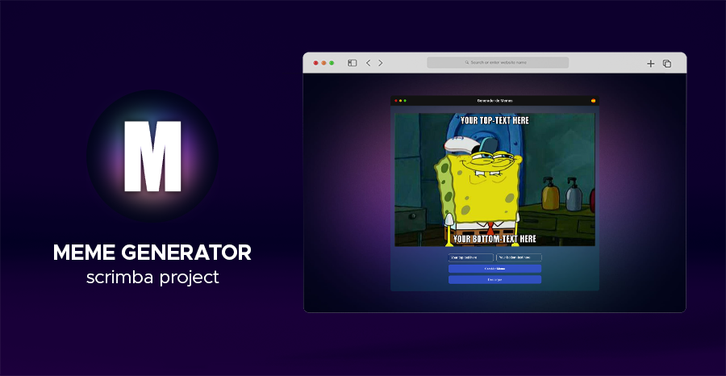

# Meme Generator - Scrimba project

[Live Demo](https://memegenerator-scrimba-jg.netlify.app/)

_Disclaimer: This project was done for educational purposes only._

## Stack

- React
- Styled Components

## Descrition

- This project was done as part of [Scrimba](https://scrimba.com/)'s React course.
- It's desktop and mobile ready.
- Extra features: Download function and English/Spanish translation.

## Getting Started with Vite

This project was bootstrapped with [Vite.js](https://github.com/vitejs/vite).

### Available Scripts

In the project directory, you can run:

#### `npm install`

#### `npm run dev`